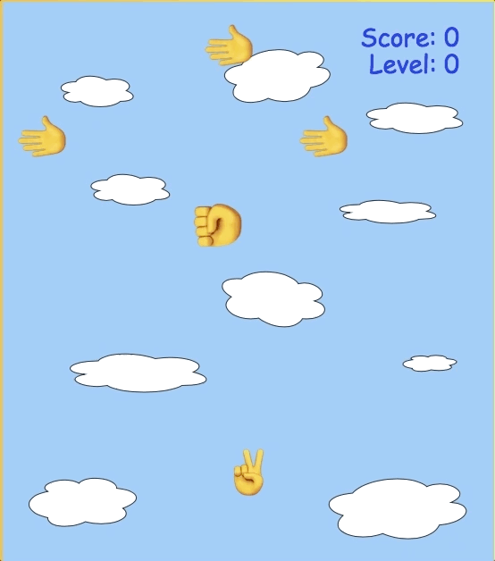

# Rock-Paper-Scissors Run!

[Live Link ](https://peterwong327.github.io/Rock-Paper-Scissors/)

### Background and Overview
Rock Paper Scissors Run! is an endless running-style game in which a player controls a pair of scissors, moving left and right, to navigate through obstacles (rocks), while cutting as much papers as possible.


<!--  -->

### Technologies
This game was implemented using JavaScript for overall structure and game logic, HTML5 Canvas for rendering, along with Webpack to bundle all the JavaScript files.

### Functionalities and MVP Features
A player can:
- Control a pair of scissors by moving it left and right
- Collect points for 'cutting' through paper obstacles
- Lose the game on collision with a rock
- Hear background music and collision sounds
- Start a game and restart after losing

#### Moving the pair of scissors
A player moves the pair of scissors by using the left and right arrow keyboard keys, which was set up with an event listener in the entry file. The event listener is linked to the Scissor class method, which updates the scissor direction based on the keypress. With a single press of a key, the pair of scissors would move continuously to that direction until it hits the edge of the screen. The overall strategy would be to continuously press on either the left or right arrow key to balance the pair of scissors.

```
window.addEventListener('keydown', moveScissors);

function moveScissors(e) {
  let code = e.keyCode;
  //if left key pressed
  if (code === 37){
    game.scissors.moveScissors(-4, 0);
    //if right key pressed
  } else if (code === 39) {
    game.scissors.moveScissors(4, 0);
  }
}
```

#### Falling Obstacles and Collision
Obstacles are generated randomly in an array using mathematical calculations.

```
createRockRow (){
  let prevRock = 0;

  for (let i = 0; i < 2; i += 1) {
    let newRock = new Rock(ctx);
    //checks if previous rock and current rock are touching
    if (Math.abs(prevRock - newRock.x) > 55) {
      this.rocks.push(newRock);
      prevRock = newRock.x;
    }
  }
}
```

Collision detection between two objects require the comparison of the positions of the objects involved. Objects are images drawn on the canvas and have x-y coordinates, along with height and width dimensions.

```
collisionRock (scissor, rock) {
  if (scissor.x + 10 < rock.x + rock.width - 10 &&
    scissor.x + 10 + scissor.width - 8 > rock.x &&
    scissor.y < rock.y + rock.height - 10 &&
    scissor.y + scissor.height - 10 > rock.y) {
    return true;
  }
}
```

#### Sound
MP3 sound clips are directly added into the project folder, linked to the main Game class constructor method. Audio clips of collision, background music, and leveling up are rendered using conditionals throughout the Game class. A mute button on the screen can be clicked to turn off all sounds. Alternatively, the 'shift' key can be pressed to toggle the 'Mute' button.

```
class Game {
  constructor(ctx) {
    this.ctx = ctx;
    this.rocks = [];
    this.papers = [];
    this.frameCount = 0;
    this.scissors = new Scissors(ctx);
    this.score = 0;
    this.playMusic = new Audio("./sounds/bgMusic2.mp3");
    this.rockSound = new Audio("./sounds/gameOver.mp3");
    this.paperSound = new Audio("./sounds/paper.mp3");
    this.startGameSound = new Audio("./sounds/startGame.mp3");
    this.toggleSound = true;
  }
  ```

#### Scoring
A user scores 1 point for each 'hand' obstacle that was 'cut' by the pair of scissors. Collision can be detected from all directions between the scissor and a paper. Once a collision with a paper obstacle is detected, a score counter increments by 1. Once a player reaches 25 points, the player goes to the next level, in which the speed of obstacles falling increases. The game ends as soon as a rock touches the pair of scissors.

### Additional features to be implemented
The following features can be added in the future:
- animation for the pair of scissors to simulate movement
- animation for collision to show piece of paper being cut
- 'power-ups' to slow down the speed of obstacles falling and/or freeze the obstacles
