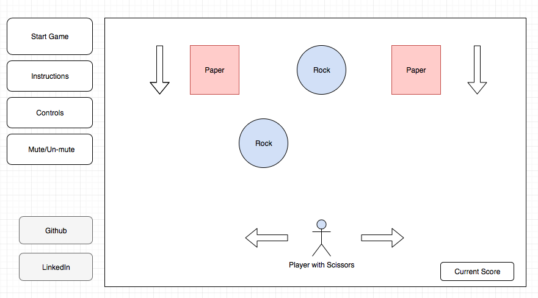

# Rock-Paper-Scissors

### Background and Overview
Rock Paper Scissors is an endless running-style game in which a player controls a pair of scissors, moving left and right, to navigate through obstacles (rocks), while cutting as much papers as possible.

### MVP Features
In Rock Paper Scissors, users will be able to:

- [ ] Control a pair of scissors by moving it left and right
- [ ] Collect points for 'cutting' through paper obstacles
- [ ] Lose the game on collision with a rock
- [ ] Hear background music and collision sounds
- [ ] Start a game and restart after losing

### Technologies
Rock Paper Scissors will be implemented using JavaScript and HTML5 Canvas.

### Wireframes
This game will consist of a single screen with the simulation canvas along with a panel on the side:

- A "Start Game" button allows the user to initiate the game when ready.

- Two boxes with information on how to play the game.

- A mute/un-mute button allows the user to toggle the sounds on/off.

- Links to my Github and LinkedIn.

### Implementation Timeline

**Over the weekend:**
- [x] Create images for the background, scissors, rocks and papers
- [x] Create/gather audio files for sound effects and background music
- [x] Setup required files within project folder: HTML and JavaScript
- [x] Save images and sounds into project folder

**Day 1:** Implement code to make background scroll from top to bottom, along with generating obstacles (rocks and papers) randomly. Goals for the day:
- [ ] Learn how to scroll the background and implement a continuous loop for the scroll
- [ ] Learn how to randomly generate the rocks and papers and have them scroll down the screen

**Day 2:** Implement ability for user to move pair of scissors left and right. Goals for the day:
- [ ] Finish random obstacle generation
- [ ] Set up keyboard keys to enable user control

**Day 3:** Implement collision detection for scissors and obstacles. Goals for the day:
- [ ] Set up collision detection for scissors and rocks: game over
- [ ] Create and display a counter to show total points
- [ ] Set up collision detection for scissors and papers: +1 to the points

**Day 4:** Implement music/sound effects, and style the frontend. Goals for the day:
- [ ] Add music to the game when the game is started
- [ ] Make a unique sound effect for different types of collisions
- [ ] Create mute functionality with button
- [ ] Add instructions to the game page
